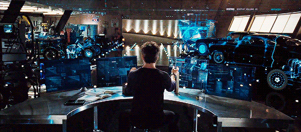

<!-- HEADER BANNER -->

  

  

<!-- ABOUT ME SECTION -->
## 🧑‍💻 About Me

<table width="100%">
  <tr>
    <td width="100%" valign="top">
      

        First year CSE undergrad. Learning and building — currently getting
        comfortable with the fundamentals in Python, C, and the web basics,
        while figuring out what to build next.
      

      

        📍 Just started college &nbsp;•&nbsp; 🌱 Still early, still exploring &nbsp;•&nbsp; 🎯 Building toward internships
      

    </td>
  </tr>
</table>

<!-- TECH STACK GRID -->
## 🛠️ My Tech Stack

  

<!-- DYNAMIC STATS WIDGETS -->
## 📊 GitHub Analytics

  
  

  

<!-- CONTRIBUTION SNAKE (fills in once the GitHub Action runs) -->
## 🐍 Contribution Snake

  <picture>
    <source media="(prefers-color-scheme: dark)" srcset="https://raw.githubusercontent.com/tejaskhare360-sketch/tejaskhare360-sketch/output/github-contribution-grid-snake-dark.svg" />
    <source media="(prefers-color-scheme: light)" srcset="https://raw.githubusercontent.com/tejaskhare360-sketch/tejaskhare360-sketch/output/github-contribution-grid-snake.svg" />
    
  </picture>

<i>Appears once the snake workflow has run at least once.</i>

<!-- SOCIALS (AT THE END) -->
## 🌐 Connect With Me

  
  
  

